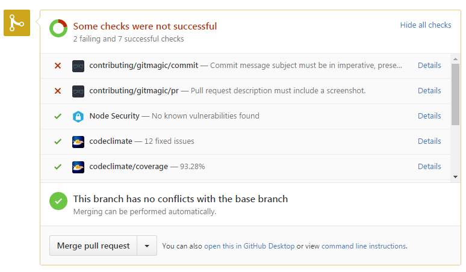

# API Final Project

## Deadline
* Friday, March 3rd at 23:59
* 4 points per 24 hours will be deducted when project is late
* No project will result in a failing grade for this course

## Resources
* [Open-source history project](https://github.com/danactive/history/)
* Each student has a specific [GitHub Issue](https://github.com/danactive/history/issues) assigned to them

## Points Breakdown
* **+2** Pull Request accepted and merged into code repository
* **+2** Pass all Pull Request checks
    * Verify step: Your branch has no conflicts with **danactive** and green check mark indicates all checks pass 
* **+1** Your pushed code references assigned GitHub issues
    * Verify by viewing GitHub.com Issue, the timeline should link to your pushed code
* **+1** Create a Pull Request from your *your username*/history to **danactive**/history
* **+1** Push code via Git to GitHub.com
* **+2** UX matches existing functionality
* **+3** Lint success
* **+3** Connect to Service (e.g. Instagram or Flickr) through API add receive correct response to solve feature request

## Communication
* GitHub.com Issue is preferred
* Slack with Domain Design team
* dan@vanarts.com is least desirable
* My VanArts will not be used
